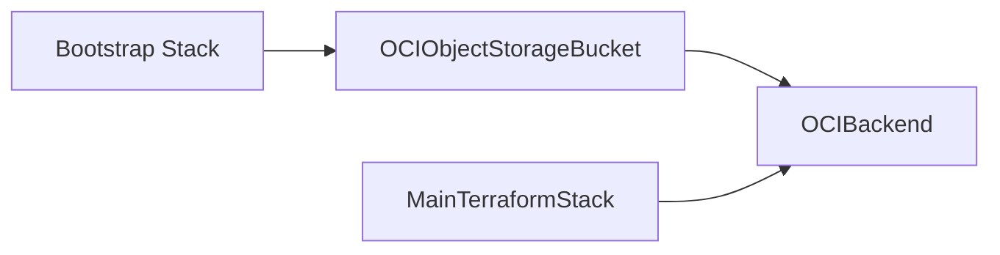

# OCI Single-Region Foundation

This repository contains a modular Terraform foundation for OCI that starts in a single region and is structured so it can expand to multiple regions later without a redesign.

## Layout

- `modules/network`: reusable OCI networking primitives
- `modules/iam`: minimal identity and access scaffolding
- `environments/mumbai`: single-region composition for the first deployment
- `bootstrap`: one-time backend bucket bootstrap for remote state

## What this foundation provides

- A reusable VCN module with public and private subnet support
- Internet, NAT, and service gateway support
- Network security group and route table wiring
- Minimal IAM scaffolding for the network foundation

## How it scales to multi-region later

The environment layer keeps region-specific values outside the modules. To add another region later, create a second environment stack that reuses the same modules with a different `region` value and region-specific naming.

Example approach:

1. Keep shared module contracts stable.
2. Create `environments/us-ashburn-1` and `environments/us-phoenix-1` using the same modules.
3. Feed each environment its own region, compartment, and CIDR inputs.
4. Add cross-region resources only at the environment layer, not inside the modules.

## Getting started

1. Apply `bootstrap/` first to create the Object Storage bucket for state.
2. Initialize `environments/mumbai/` with `terraform init -backend-config=...`, pointing at the bucket created by bootstrap.
3. Update `environments/mumbai/terraform.tfvars` with your tenancy values and CIDRs.
4. Run `terraform plan` from `environments/mumbai/` to validate the foundation.

## Remote state flow

The bootstrap stack creates the Object Storage bucket, then the main stack uses the OCI backend:

